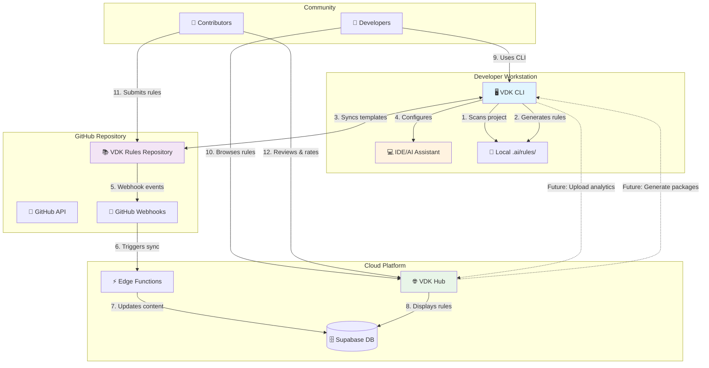
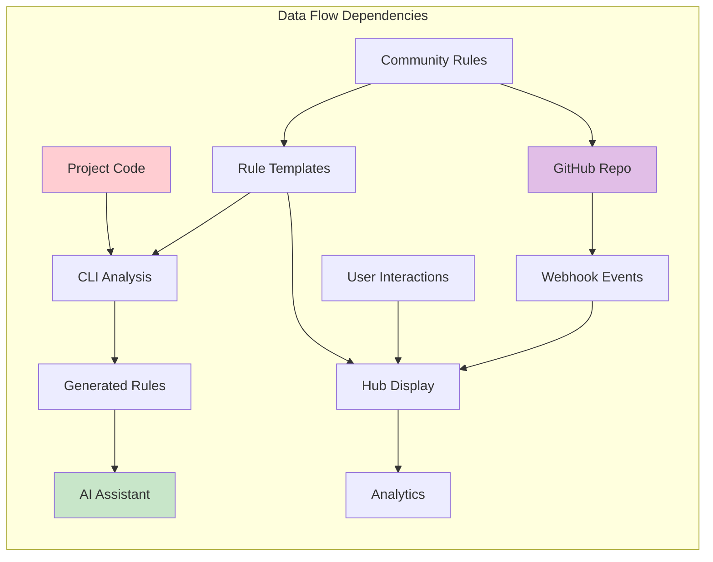
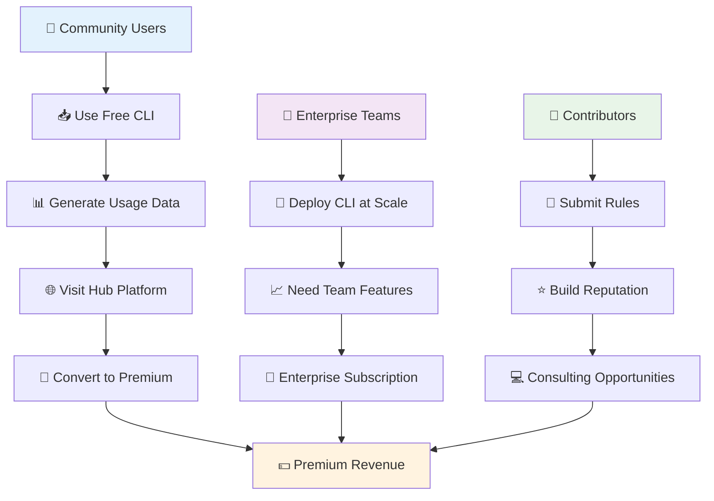
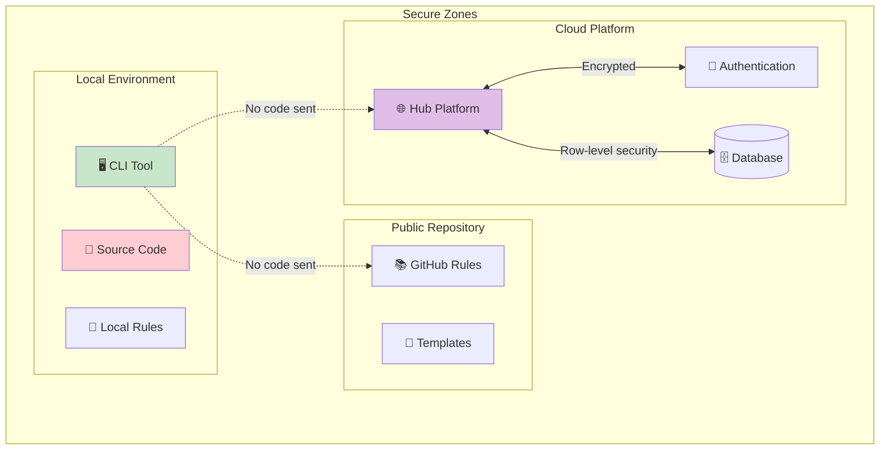

# VibeKit VDK Integration Matrix & Visual Connection Guide

## 📊 High-Level Integration Matrix

| From → To | **VDK CLI** | **VDK Rules** | **VDK Hub** |
|-----------|-------------|---------------|-------------|
| **VDK CLI** | ⚙️ *Self-contained analysis* | 📤 **PUSHES** rule templates<br/>📥 **PULLS** community rules<br/>🔄 **SYNCS** via GitHub API | 🚀 **PLANNED** analytics upload<br/>📦 **PLANNED** package download |
| **VDK Rules** | 📤 **PROVIDES** rule templates<br/>📥 **RECEIVES** generated rules<br/>🏷️ **VALIDATES** rule format | 📚 *Central repository* | 📤 **FEEDS** rule content<br/>🔄 **SYNCS** via GitHub webhooks<br/>⚡ **TRIGGERS** real-time updates |
| **VDK Hub** | 📥 **PLANNED** to receive analytics<br/>📤 **PLANNED** to provide packages | 📥 **CONSUMES** rule content<br/>📊 **DISPLAYS** rule catalog<br/>🎯 **CURATES** community rules | 🌐 *Web interface & community* |

## 🔄 Data Flow Architecture



## 🏗️ Technical Integration Patterns

### 📡 CLI ↔ Rules Repository Integration

| **Aspect** | **Implementation** | **Frequency** | **Direction** |
|------------|-------------------|---------------|---------------|
| **Template Sync** | GitHub API calls to fetch latest templates | Manual/Scheduled | Rules → CLI |
| **Rule Generation** | CLI analyzes project & generates from templates | On-demand | CLI → Local |
| **Community Updates** | Pull latest community-contributed rules | Weekly/Manual | Rules → CLI |
| **Version Control** | Git-based versioning with semantic versions | Per release | Bidirectional |

```typescript
// CLI Sync Implementation
interface RuleSyncService {
  // Download templates from repository
  syncTemplates(): Promise<SyncResult>
  
  // Check for updates
  checkForUpdates(): Promise<UpdateInfo>
  
  // Resolve conflicts between local and remote
  resolveConflicts(strategy: ConflictStrategy): Promise<Resolution[]>
  
  // Generate project-specific rules from templates
  generateProjectRules(templates: Template[], analysis: ProjectAnalysis): Promise<Rule[]>
}
```

### 🌐 Hub ↔ Rules Repository Integration

| **Aspect** | **Implementation** | **Frequency** | **Direction** |
|------------|-------------------|---------------|---------------|
| **Content Sync** | GitHub webhooks + API polling | Real-time + Hourly | Rules → Hub |
| **Rule Metadata** | Parse YAML frontmatter from .mdc files | Per file change | Rules → Hub |
| **Community Features** | Store ratings, comments, usage stats | Real-time | Hub → Database |
| **Search Index** | Full-text search across rule content | Per sync | Rules → Hub |

```typescript
// Hub Integration Implementation
interface HubSyncService {
  // GitHub webhook handler
  handleWebhook(payload: GitHubWebhook): Promise<void>
  
  // Scheduled sync job
  syncFromGitHub(): Promise<SyncReport>
  
  // Parse and store rule content
  processRuleFile(file: GitHubFile): Promise<Rule>
  
  // Update search index
  updateSearchIndex(rules: Rule[]): Promise<void>
}
```

### 🔮 CLI ↔ Hub Integration (Planned)

| **Aspect** | **Implementation** | **Frequency** | **Direction** |
|------------|-------------------|---------------|---|
| **Analytics Upload** | Usage metrics and rule effectiveness | Daily/Session | CLI → Hub |
| **Package Download** | Pre-configured rule packages | On-demand | Hub → CLI |
| **Team Sync** | Shared team configurations | Real-time | Bidirectional |
| **Premium Features** | Enterprise rule management | Subscription | Hub → CLI |

## 📋 Integration Dependency Matrix

### 🔗 Direct Dependencies

| **Component** | **Depends On** | **Dependency Type** | **Failure Impact** |
|---------------|----------------|---------------------|-------------------|
| **CLI** | Rules Repository | Soft (cached fallback) | Reduced template updates |
| **CLI** | GitHub API | Soft (optional sync) | No community updates |
| **Hub** | Rules Repository | Hard (content source) | No rule display |
| **Hub** | Supabase | Hard (data/auth) | Complete service failure |
| **Hub** | GitHub API | Soft (sync updates) | Stale content |

### 🔄 Data Dependencies



## 🛠️ Technical Integration Points

### 📁 File System Integration

```bash
# CLI creates and manages these structures
project-root/
├── .ai/rules/                    # Generated rules (CLI output)
│   ├── 00-core-agent.mdc        # Core behavior rules
│   ├── 01-project-context.mdc   # Project-specific patterns
│   ├── languages/               # Language-specific rules
│   └── technologies/            # Framework-specific rules
├── vdk.config.json              # CLI configuration
└── .vscode/                     # IDE-specific integration
    └── settings.json            # AI assistant configuration
```

### 🔌 API Integration Points

#### GitHub API Integration
```typescript
interface GitHubIntegration {
  // CLI uses these endpoints
  fetchRepositoryContents(path: string): Promise<GitHubContent[]>
  downloadFile(url: string): Promise<string>
  getLatestCommit(branch: string): Promise<GitHubCommit>
  
  // Hub uses these endpoints  
  setupWebhook(events: string[]): Promise<GitHubWebhook>
  getFileHistory(path: string): Promise<GitHubCommit[]>
  searchContent(query: string): Promise<GitHubSearchResult>
}
```

#### Hub API Integration (Future)
```typescript
interface HubAPIIntegration {
  // CLI will use these endpoints
  uploadUsageMetrics(metrics: UsageMetrics): Promise<void>
  downloadRulePackage(packageId: string): Promise<RulePackage>
  syncTeamConfiguration(teamId: string): Promise<TeamConfig>
  
  // Authentication
  authenticateWithToken(token: string): Promise<AuthResult>
}
```

## 🔄 Synchronization Mechanisms

### 📅 Sync Schedules & Triggers

| **Trigger Type** | **CLI** | **Hub** | **Frequency** |
|------------------|---------|---------|---------------|
| **Manual User Action** | `npm run sync` | Admin dashboard sync button | On-demand |
| **Scheduled** | Auto-sync daemon (configurable) | Cron jobs via Edge Functions | Hourly/Daily |
| **Event-Driven** | Git hook (optional) | GitHub webhooks | Real-time |
| **Startup** | Check for updates on init | Background sync on deploy | Per session/deploy |

### 🔀 Conflict Resolution Strategies

```typescript
enum ConflictResolutionStrategy {
  PROMPT = 'prompt',     // Ask user for each conflict
  REMOTE = 'remote',     // Always use remote version
  LOCAL = 'local',       // Keep local version
  BACKUP = 'backup'      // Backup local, use remote
}

interface ConflictResolver {
  detectConflicts(local: Rule[], remote: Rule[]): Conflict[]
  resolveConflict(conflict: Conflict, strategy: ConflictResolutionStrategy): Resolution
  applyResolution(resolution: Resolution): Promise<void>
}
```

## 🎯 Business Integration Model

### 💰 Revenue Flow Integration



### 🔄 Value Exchange Matrix

| **Component** | **Provides** | **Receives** | **Value Created** |
|---------------|--------------|--------------|-------------------|
| **CLI** | Project analysis, rule generation | Rule templates, community patterns | Developer productivity |
| **Rules Repository** | Rule templates, patterns, best practices | Community contributions, updates | Knowledge accumulation |
| **Hub** | Discovery, curation, team features | User engagement, premium subscriptions | Community platform |

## 🚀 Future Integration Roadmap

### Phase 1: Enhanced CLI-Hub Connection (Q3 2025)
- [ ] Analytics upload from CLI to Hub
- [ ] Rule effectiveness tracking
- [ ] Basic team synchronization
- [ ] Premium rule packages

### Phase 2: Advanced Features (Q4 2025)
- [ ] Real-time team collaboration
- [ ] Custom rule marketplace
- [ ] Enterprise SSO integration
- [ ] Advanced analytics dashboard

### Phase 3: AI-Powered Features (2026)
- [ ] Predictive rule suggestions
- [ ] Automated rule optimization
- [ ] Cross-team pattern sharing
- [ ] AI-powered rule generation

## 🔒 Security & Privacy Integration

### 🛡️ Security Boundaries



### 🔐 Data Privacy Matrix

| **Data Type** | **CLI** | **Rules Repo** | **Hub** | **Privacy Level** |
|---------------|---------|----------------|---------|-------------------|
| **Source Code** | Local only | Never stored | Never transmitted | 🔒 Private |
| **Project Metadata** | Local + optional analytics | Template variables only | Aggregated metrics | 🟡 Limited |
| **Rule Content** | Cached locally | Public repository | Public display | 🟢 Public |
| **User Data** | Config only | Contributor info | Full profile | 🟡 Protected |
| **Usage Analytics** | Optional collection | Not collected | Aggregated only | 🟡 Anonymized |

## 📊 Integration Success Metrics

### 🎯 Technical KPIs

| **Metric** | **CLI** | **Hub** | **Overall Ecosystem** |
|------------|---------|---------|----------------------|
| **Sync Success Rate** | 99%+ successful syncs | 99%+ webhook delivery | 99%+ cross-system consistency |
| **Response Time** | <5s rule generation | <2s rule search | <3s end-to-end updates |
| **Data Consistency** | Local-remote parity | Real-time sync accuracy | Cross-platform consistency |
| **Error Rate** | <1% failed operations | <1% sync failures | <1% integration errors |

### 📈 Business KPIs

| **Metric** | **Target** | **Integration Benefit** |
|------------|------------|------------------------|
| **User Activation** | 80% CLI users visit Hub | Conversion funnel optimization |
| **Community Growth** | 50+ new rules/month | Network effects amplification |
| **Enterprise Adoption** | 25% teams use Hub features | Premium conversion rates |
| **Developer Satisfaction** | 4.5/5 rating | Integrated experience quality |

This comprehensive integration matrix shows how the three VibeKit VDK components work together to create a powerful, scalable ecosystem for AI-assisted development. The architecture balances independence (each component can function alone) with synergy (together they create exponential value).
